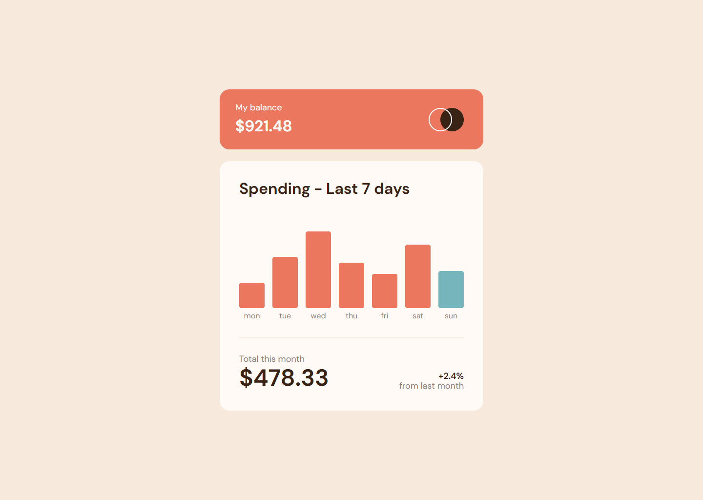

# Frontend Mentor - Expenses chart component solution

This is a solution to the [Expenses chart component challenge on Frontend Mentor](https://www.frontendmentor.io/challenges/expenses-chart-component-e7yJBUdjwt). Frontend Mentor challenges help you improve your coding skills by building realistic projects.

## Table of contents

- [Overview](#overview)
  - [The challenge](#the-challenge)
  - [Screenshot](#screenshot)
  - [Links](#links)
- [My process](#my-process)
  - [Built with](#built-with)
  - [What I learned](#what-i-learned)
  - [Continued development](#continued-development)
  - [Useful resources](#useful-resources)
- [Author](#author)

## Overview

### The challenge

Users should be able to:

- View the bar chart and hover over the individual bars to see the correct amounts for each day
- See the current day’s bar highlighted in a different colour to the other bars
- View the optimal layout for the content depending on their device’s screen size
- See hover states for all interactive elements on the page
- **Bonus**: Use the JSON data file provided to dynamically size the bars on the chart

### Screenshot

### Links

- Solution URL: [https://github.com/miranlegin/fem-expenses-chart](https://github.com/miranlegin/fem-expenses-chart)
- Live Site URL: [https://frontend-mentor-challenge08.netlify.app/](https://frontend-mentor-challenge08.netlify.app/)

## My process

### Built with

- Fetch API
- CSS custom properties
- SCSS
- Some workaround technique for animating bar charts

### What I learned

I've worked before with Fetch API but after not using it for some time I always forget the syntax. This challenge sharpened my skills and i will gladly accent future challenges.

### Continued development

As this is one of the first challenges with Javascript i'm getting in the zone for tackle some more advanced examples as this is quite the basic one.

### Useful resources

- [Fetch API](https://www.javascripttutorial.net/javascript-fetch-api/) - Example of using Fetch API
- [Easings.net](https://easings.net/) - List of predefined cubic-besier easing functions

## Author

- Frontend Mentor - [@miranlegin](https://www.frontendmentor.io/profile/miranlegin)
